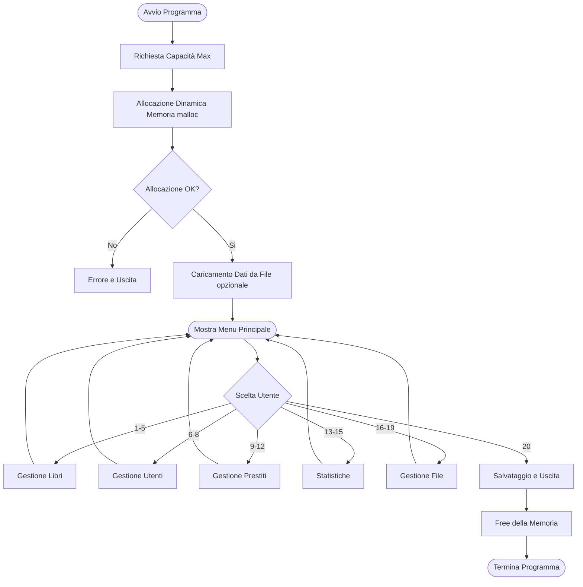

# 3. INTRODUZIONE

## Descrizione del problema
Il progetto nasce dalla necessità della Biblioteca Comunale di avere un sistema informatico per la gestione automatizzata del proprio catalogo e dei prestiti.

## Obiettivi del progetto
L'obiettivo principale è sviluppare un programma completo che permetta al personale di una biblioteca digitale di:
* Gestire un catalogo di libri;
* Registrare e monitorare i prestiti agli utenti;
* Salvare e caricare i dati su file;
* Generare statistiche e report.

## Tecnologie utilizzate
Per lo sviluppo e la gestione del progetto sono stati utilizzati i seguenti strumenti:
* **Linguaggio di programmazione:** C.
* **Sistema Operativo:** Microsoft Windows 11.
* **Ambiente di Sviluppo (Editor):** Visual Studio Code (VS Code).
* **Compilatore:** **GCC (MinGW-w64)**, configurato per l'ambiente di sviluppo.
* **Gestione del Codice e Collaborazione:** Il progetto è stato sviluppato in team utilizzando Git per il controllo di versione. Per coordinare il lavoro, è stata creata un'organizzazione privata su GitHub che ha ospitato la repository remota, permettendo la collaborazione tra i membri del gruppo.

# 4. ANALISI DEL PROBLEMA

## 4.1 Descrizione del caso di Studio
Il progetto si colloca nel contesto di una Biblioteca Comunale che necessita di digitalizzare la gestione del proprio archivio di titoli e dell'utenza. Il nuovo sistema informatico dovrà accogliere tutti i dati d'interesse, permettendo di tenere traccia dei libri disponibili nel catalogo, dell'elenco degli utenti iscritti alla biblioteca e dello storico completo dei prestiti effettuati, tra attivi e conclusi.

## 4.2 Requisiti Funzionali
Il sistema deve offrire un menu interattivo che garantisca le seguenti funzionalità:

### Gestione Libri
Il sistema deve permettere l'inserimento di nuovi volumi controllando l'univocità del codice ISBN e validando i dati (anno di pubblicazione 1800-2025, numero copie > 0). Deve essere possibile:
* Visualizzare l'elenco completo dei libri in formato tabellare.
* Cercare un libro specifico tramite codice ISBN.
* Cercare tutti i libri di un determinato autore.
* Visualizzare solo i libri attualmente disponibili per il prestito (ovvero per cui ci sono copie in magazzino), ordinati per titolo.

### Gestione Utenti
È richiesta la registrazione di nuovi utenti con controllo di univocità sul codice utente. Il sistema deve permettere la visualizzazione dell'elenco iscritti e la ricerca puntuale di un utente tramite il suo codice identificativo.

### Gestione Prestiti
Il sistema deve permettere la gestione dei prestiti dai seguenti punti di vista:
* **Registrazione Prestito:** Associa un libro a un utente, verificando disponibilità ed esistenza. Deve generare un ID univoco incrementale, decrementare le copie disponibili e calcolare automaticamente la data di restituzione (30 giorni dopo il prestito).
* **Restituzione:** Aggiorna lo stato del prestito a "restituito" e incrementa nuovamente le copie disponibili del libro.
* **Visualizzazione:** Deve mostrare i prestiti attivi e lo storico completo di uno specifico utente.

### Statistiche e Report
Il software deve fornire informazioni sulla biblioteca tramite:
* Statistiche generali (totali di libri, copie, utenti, prestiti attivi/totali).
* Conteggio dei libri suddivisi per genere.
* Classifica dei 5 libri più prestati.

### Salvataggio e Caricamento Dati (File)
Per garantire che i dati non vadano persi alla chiusura del programma, il sistema deve:
* Salvare e caricare i database (libri, utenti, prestiti) su file binari (`.dat`).
* Esportare report leggibili in formato testo (`.txt`) per il catalogo e i prestiti attivi.

## 4.3 Requisiti Non Funzionali
Il sistema deve rispettare alcuni vincoli qualitativi e tecnici:

* **Validazione e Robustezza:** Il sistema deve prevenire inserimenti errati validando gli input (es. formato ISBN, validità date, email contenente '@') e gestire situazioni critiche come database pieni o file mancanti senza crashare.
* **Gestione della Memoria:** L'allocazione delle strutture dati deve essere dinamica (`malloc`), dimensionata in base alla capacità massima scelta dall'utente all'avvio, con corretta deallocazione alla chiusura per evitare memory leak.
* **Usabilità:** I messaggi di errore devono essere esplicativi per l'operatore.

# 5. PROGETTAZIONE

## 5.1 Strutture Dati
Sono state definite tre strutture dati principali utilizzando `typedef` per semplificare la sintassi nel codice. Seguono i dettagli sulle singole strutture e sulle relazioni tra di esse. Le dimensioni dei vari campi sono state assegnate per rispettare i requisiti e garantire lo spazio necessario per il terminatore di stringa `\0`.

### 5.1.1 Struct Libro
La struttura `libro` rappresenta l'unità fondamentale del catalogo.

```c
typedef struct {
    char codice_ISBN[18];
    char titolo[101];
    char autore[51];
    int anno_pubblicazione;
    int numero_copie;
    char genere[31];
} libro;
```

In questa struct, `codice_ISBN[18]` rappresenta la chiave primaria.

### 5.1.2 Struct Utente
La struttura `utente` gestisce i dati anagrafici delle persone iscritte alla biblioteca. Ogni utente è identificato univocamente da un codice intero progressivo, il quale costituisce la chiave primaria.

```c
typedef struct {
    int codice_utente;
    char nome[51];
    char cognome[51];
    char email[81];
    char data_iscrizione[11];
} utente;
```

### 5.1.3 Struct Prestito
La struttura `prestito` rappresenta l'entità di relazione del sistema: essa collega logicamente un `libro` a un `utente`, tracciando le tempistiche e lo stato della transazione.

```c
typedef struct {
    int codice_prestito;
    char codice_ISBN_libro[18];
    int codice_utente;
    char data_prestito[11];
    char data_restituzione[11];
    int restituito;
} prestito;
```

La chiave primaria è `codice_prestito`, c'è inoltre un vincolo d'integrità referenziale  in corrispondenza del campo `codice_ISBN_libro[18]`, il cui valore dovrà essere presente tra i libri.

## 5.2 Architettura del Sistema

### 5.2.1 Organizzazione del Codice
Il software è stato sviluppato nella maniera più modulare possibile, sfruttando al massimo la proceduralità di C. Sebbene il codice risieda in un unico file sorgente (`main.c`) per semplicità di compilazione, logicamente è suddiviso in tre macro-aree distinte:

1.  **Definizione delle Strutture Dati:** All'inizio del file sono definite le `typedef struct` per garantire visibilità globale dei tipi di dato.
2.  **Prototipi delle Funzioni:** Dichiarati prima del `main` per informare il compilatore delle funzionalità disponibili.
3.  **Implementazione:** Le funzioni sono raggruppate per area tematica (Gestione Libri, Utenti, Prestiti, File) dopo il `main`.

**Scelte Architetturali Significative:**
* **Gestione della Memoria:** Il sistema utilizza rigorosamente l'allocazione dinamica (`malloc`) nel `main`. I puntatori agli array (`libro *ptr_libri`, ecc.) vengono passati "per riferimento" alle varie funzioni. Questa scelta evita l'uso di variabili globali (spesso sconsigliate) e ottimizza l'uso dello stack, passando solo gli indirizzi di memoria invece di copiare intere strutture dati.
* **Interfaccia Utente (CLI):** L'interazione avviene tramite un ciclo `do-while` che racchiude uno `switch-case`. Questo pattern garantisce che il menu venga riproposto dopo ogni operazione finché l'utente non seleziona esplicitamente l'uscita (case 20).
* **Algoritmi di Ordinamento:** Per la funzionalità "Libri disponibili per prestito", è stato implementato l'algoritmo **Bubble Sort** per ordinare i titoli alfabeticamente. La scelta è ricaduta su questo algoritmo per la sua semplicità implementativa, adeguata alla mole di dati prevista per una biblioteca comunale.

### 5.2.2 Elenco Funzioni Principali
Di seguito vengono descritte le funzioni core che orchestrano la logica del programma:

* `void inserisci_libro(...)`: Gestisce l'input dei dati di un nuovo libro. Implementa controlli di validazione (ISBN univoco, anno 1800-2025) e gestisce l'inserimento nell'array dinamico.
* `void registra_prestito(...)`: Funzione complessa che coordina tre entità. Verifica la disponibilità del libro, l'esistenza dell'utente, decrementa le copie disponibili e calcola automaticamente la data di restituzione futura.
* `void calcoladata(char *data)`: Algoritmo dedicato alla gestione temporale. Prende una data in input, aggiunge 30 giorni gestendo correttamente il fine mese, il cambio anno e gli anni bisestili.
* `void statistiche_generali(...)`: Aggrega i dati attraversando tutti gli array per calcolare totali, medie e individuare il libro più popolare nello storico.
* `void salva_libri_binario(...)`: Si occupa della persistenza, scrivendo prima un intero (dimensione array) e poi l'intero blocco di memoria della struct su file `.dat` tramite `fwrite`.

### 5.2.3 Schema del Flusso del Programma
Il seguente diagramma illustra il ciclo di vita dell'applicazione, dall'avvio alla chiusura.

