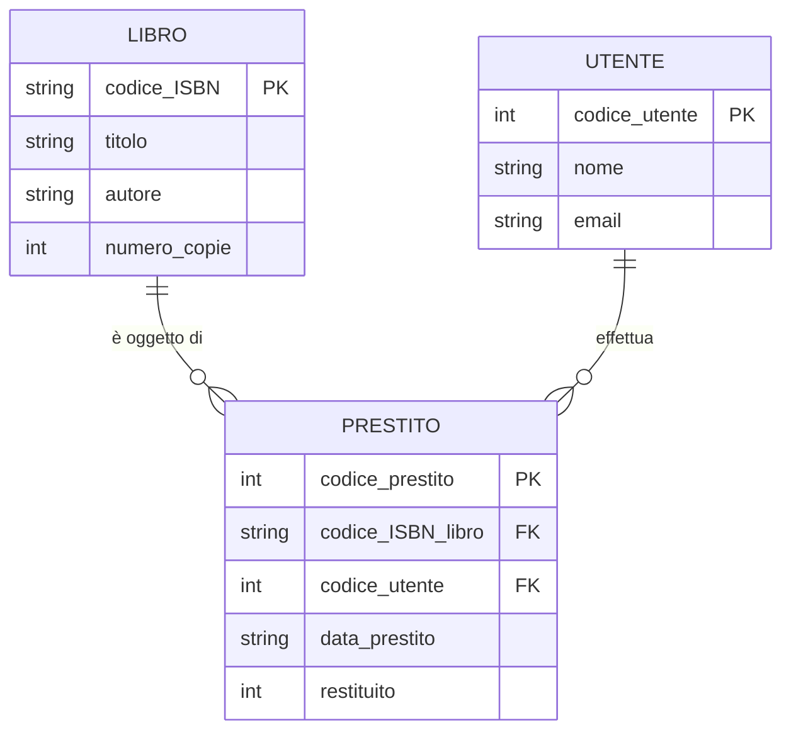
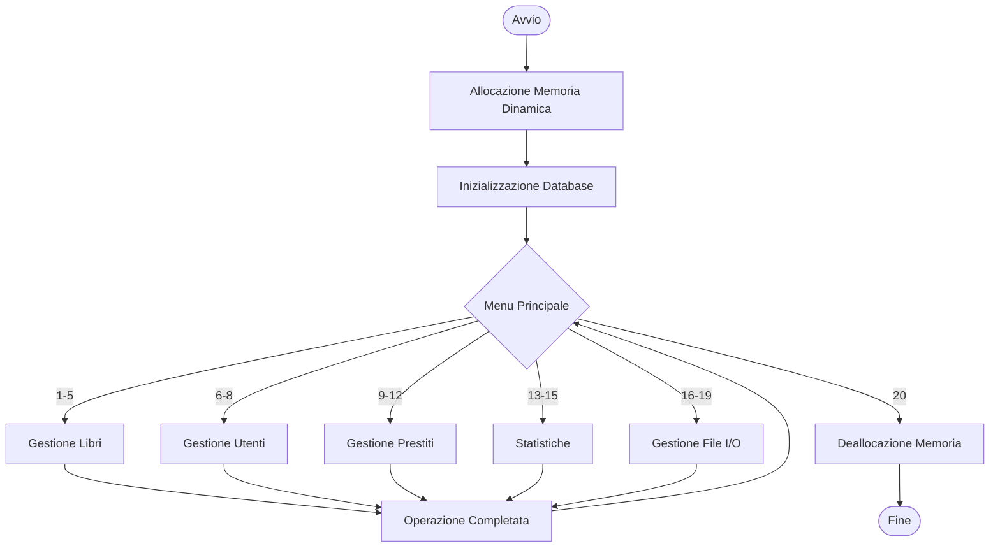

# 📄 Report Progetto: Sistema di Gestione Biblioteca Digitale

## 1. FRONTESPIZIO

| Campo | Dettaglio |
| :--- | :--- |
| **Titolo del Progetto** | Sistema di Gestione Biblioteca Digitale |
| **Nome e Cognome Studente** | Tommaso Pellegrinelli |
| **Numero di Matricola** | 126379 |
| **Anno Accademico** | 2025/26 |
| **Data di Consegna** | 08/12/2025 |

***

## 2. INDICE

1. FRONTESPIZIO
2. INDICE
3. INTRODUZIONE
4. ANALISI DEL PROBLEMA
    4.1 Caso di Studio
    4.2 Requisiti Funzionali Dettagliati
    4.3 Requisiti Non Funzionali
5. PROGETTAZIONE
    5.1 Strutture Dati
    5.2 Architettura del Sistema
    5.3 Gestione della Memoria
    5.4 Gestione dei File
6. IMPLEMENTAZIONE
    6.1 Funzioni Principali
7. TESTING

***

## 3. INTRODUZIONE

Il progetto consiste nello sviluppo di un'applicazione in linguaggio C finalizzata alla creazione di un **Sistema di Gestione Biblioteca Digitale**. L'obiettivo principale è fornire uno strumento completo per la gestione del catalogo dei libri, l'anagrafica degli utenti, lo storico dei prestiti e l'estrazione di dati statistici e di reportistica.

* **Obiettivi Raggiunti**: Il sistema implementa tutte le funzionalità richieste, dall'input validato dei dati all'output formattato, inclusa la persistenza dei dati su file binari e l'esportazione su file di testo.
* **Tecnologie Utilizzate**: L'applicazione è stata sviluppata interamente in **Linguaggio C**, utilizzando il compilatore GCC e le librerie standard (`stdio.h`, `stdlib.h`, `string.h`, `ctype.h`).

***

## 4. ANALISI DEL PROBLEMA

### 4.1 Caso di Studio

La necessità operativa è gestire il catalogo e i prestiti per una **Biblioteca Comunale**. Il sistema deve tracciare con precisione i libri disponibili, gli utenti registrati e lo storico completo di tutte le transazioni di prestito.

### 4.2 Requisiti Funzionali Dettagliati

Il sistema è suddiviso in cinque aree principali, ciascuna con specifiche funzionalità di gestione e validazione.

---

#### A. GESTIONE LIBRI

| Requisito | Dettaglio Funzionale |
| :--- | :--- |
| **Inserimento Nuovo Libro (1)** | Richiede tutti i dati del libro. Verifica che l'**ISBN non sia duplicato** (deve essere univoco). Valida l'**anno di pubblicazione** nel range 1800-2025 e il **numero di copie** sia maggiore di 0. |
| **Visualizzazione Catalogo (2)** | Stampa l'elenco completo dei libri in formato **tabellare**, mostrando ISBN, titolo, autore, anno, copie disponibili e genere. |
| **Ricerca per ISBN (3)** | Richiede l'ISBN da cercare e visualizza i dettagli completi del libro se trovato; altrimenti, fornisce un messaggio di errore. |
| **Ricerca per Autore (4)** | Richiede il nome dell'autore e visualizza **tutti i libri** di quell'autore. Il confronto deve utilizzare `strcmp()` (case-sensitive). |
| **Libri Disponibili (5)** | Visualizza solo i libri con **`numero_copie > 0`**. L'elenco deve essere **ordinato per titolo** (ordine alfabetico crescente). |

---

#### B. GESTIONE UTENTI

| Requisito | Dettaglio Funzionale |
| :--- | :--- |
| **Inserimento Nuovo Utente (6)** | Richiede tutti i dati. Controlla che il **`codice_utente` sia univoco**. La **data di iscrizione** è inserita manualmente. |
| **Visualizzazione Utenti (7)** | Stampa l'elenco completo, mostrando codice, nome, cognome, email e data di iscrizione. |
| **Ricerca per Codice (8)** | Richiede il codice utente e visualizza i dettagli completi se l'utente viene trovato. |

---

#### C. GESTIONE PRESTITI

| Requisito | Dettaglio Funzionale |
| :--- | :--- |
| **Registrazione Prestito (9)** | Richiede ISBN del libro e codice utente. **Verifica** che il libro esista e abbia copie disponibili (`numero_copie > 0`) e che l'utente esista. **Decrementa** automaticamente `numero_copie`. Genera un `codice_prestito` univoco (incrementale) e calcola automaticamente la **`data_restituzione_prevista`** (30 giorni dopo la `data_prestito`). Imposta `restituito = 0`. |
| **Registrazione Restituzione (10)** | Richiede il `codice_prestito`. Verifica che il prestito esista e non sia già restituito. Imposta **`restituito = 1`** e **incrementa** automaticamente `numero_copie` del libro. |
| **Prestiti Attivi (11)** | Mostra tutti i prestiti con **`restituito = 0`**. Visualizza codice prestito, titolo libro, nome utente e le date di prestito/restituzione prevista. |
| **Storico Utente (12)** | Richiede il codice utente. Mostra **tutti i prestiti** (attivi e passati) di quell'utente e indica chiaramente quali sono stati restituiti e quali no. |

---

#### D. STATISTICHE E REPORT

| Requisito | Dettaglio Funzionale |
| :--- | :--- |
| **Statistiche Generali (13)** | Calcola e mostra: numero totale di libri nel catalogo, numero totale di copie disponibili, numero totale di utenti registrati, numero totale di prestiti effettuati, numero di prestiti attualmente attivi e il **libro più prestato** (nello storico). |
| **Libri per Genere (14)** | Visualizza il **conteggio dei libri** suddiviso per genere. |
| **Top 5 Libri (15)** | Visualizza i **5 libri** con il maggior numero di prestiti. Il formato include Posizione, Titolo, Autore e Numero di prestiti. |

---

#### E. GESTIONE FILE

| Requisito | Dettaglio Funzionale |
| :--- | :--- |
| **Salvataggio Binario (16)** | Salva i dati su tre file binari separati (`libri.dat`, `utenti.dat`, `prestiti.dat`). Il formato per ogni file è: `[numero_elementi (int)]` seguito dall'array di strutture. |
| **Caricamento Binario (17)** | Legge i dati dai file binari, leggendo prima il numero di elementi per **allocare dinamicamente** l'array della dimensione corretta. Deve gestire correttamente l'assenza dei file. |
| **Esporta Catalogo Testo (18)** | Crea un file `catalogo.txt` leggibile, scrivendo tutti i libri in formato testuale, uno per riga. |
| **Esporta Report Prestiti Testo (19)** | Crea un file `report_prestiti.txt` scrivendo solo i **prestiti attivi** in formato leggibile. Deve includere codice prestito, ISBN libro, titolo libro, codice utente, nome utente e le date. |
| **Esci (20)** | Prima di uscire, **chiede se salvare** i dati su file binario e **libera tutta la memoria** allocata dinamicamente. |

### 4.3 Requisiti Non Funzionali

* **Allocazione Dinamica**: Tutti gli array sono allocati dinamicamente con `malloc()` e la capacità massima è definita dall'utente all'avvio.
* **Robustezza e Gestione Errori**: Il codice include il controllo del ritorno di `malloc()` e `fopen()`. Il sistema deve informare l'utente in caso di array pieni.
* **Validazione Input**: Controlli rigorosi sono implementati per ISBN, Anno (1800-2025), Numero copie (>0), Email (presenza di '@') e Date (formato "gg/mm/aaaa").

## 5. PROGETTAZIONE

### 5.1 Strutture Dati

## 5. PROGETTAZIONE

### 5.1 Strutture Dati

Il sistema gestisce le informazioni attraverso tre strutture dati principali (`struct`), definite tramite `typedef` per facilitarne l'utilizzo. Di seguito sono riportate le definizioni in codice e le motivazioni progettuali.

#### 1. Struct Libro
Rappresenta un volume all'interno del catalogo.

```c
typedef struct
{
    char codice_ISBN[18]; // 13 cifre + 4 trattini + terminatore
    char titolo[101];
    char autore[51];
    int anno_pubblicazione; // Range: 1800-2025
    int numero_copie;
    char genere[31]; 
} libro;
```

#### 2. Struct Utente
Racchiude le informazioni di un utente registrato nel sistema della libreria. 
```c
typedef struct
{
    int codice_utente;
    char nome[51];
    char cognome[51];
    char email[81];
    char data_iscrizione[11]; // formato gg/mm/aaaa
} utente;
```
#### 3. Struct Prestito
Contiene le informazioni dettagliate di un prestito all'interno del sistema della libreria. 
```c
typedef struct
{
    int codice_prestito; // chiave univoca autoincrementata
    char codice_ISBN_libro[18];
    int codice_utente;
    char data_prestito[11];     // formato gg/mm/aaaa
    char data_restituzione[11]; // 30 giorni dopo il prestito
    int restituito;             // 1=restituito; 0=in corso
} prestito;
```
#### Schema di relazione tra le struct:



### 5.2 Architettura del Sistema

Il sistema adotta un'architettura **modulare** e a **menu-driven** per garantire leggibilità e manutenibilità.

* **Controllo Centrale (`main`)**: La funzione `main` funge da modulo di controllo, gestendo l'allocazione iniziale della memoria dinamica, il loop del menu principale e la gestione degli array principali (puntatori e contatori).
* **Moduli Funzionali**: La logica di business (es. inserimento, ricerca, calcolo statistiche) è isolata in funzioni dedicate (`inserisci_libro`, `registra_prestito`, etc.), aumentando l'incapsulamento.
* **Funzioni Helper**: Funzioni ausiliarie (es. `is_ISBN`, `calcoladata`) gestiscono la validazione e la manipolazione complessa dei dati in modo isolato, migliorando la riusabilità del codice.
  

### 5.3 Gestione della Memoria

* **Allocazione Dinamica**: La memoria per i tre array di strutture (`ptr_libri`, `ptr_utenti`, `ptr_prestiti`) è allocata dinamicamente all'avvio del programma utilizzando la funzione **`malloc()`**, basandosi sulle capacità massime (`cap...`) fornite dall'utente.
* **Controllo Errori**: Dopo ogni chiamata a `malloc()`, è implementato un controllo per `NULL` al fine di gestire eventuali fallimenti nell'allocazione (Robustezza).
* **Strategia di Deallocazione**: La deallocazione è gestita centralmente e in modo esplicito nella routine di uscita (Case 20). Vengono eseguite chiamate **`free()`** per tutti e tre i puntatori allocati dinamicamente, prevenendo *memory leaks* (perdite di memoria).
* **Caricamento Dati**: Nella fase di caricamento da file binario (Punto 17), la memoria precedentemente allocata viene liberata (`free()`) prima di riallocare un nuovo blocco dimensionato esattamente in base al contatore letto dal file.

### 5.4 Gestione dei File

Il sistema utilizza due approcci distinti per la persistenza e la reportistica:

| Tipo di File | Modalità e Scopo | Formato e Implementazione |
| :--- | :--- | :--- |
| **Binario (`.dat`)** | **Salvataggio/Caricamento (Punti 16, 17)**. Utilizzato per la persistenza dei dati, garantendo efficienza e integrità delle strutture. | Apertura in modalità **"rb" / "wb"**. Il formato salva prima il contatore degli elementi (`int`) e poi l'intero array di strutture (`fwrite / fread`), garantendo il ripristino corretto della dimensione dinamica. |
| **Testo (`.txt`)** | **Esportazione Report (Punti 18, 19)**. Utilizzato per generare report leggibili e tabellari del catalogo e dei prestiti attivi. | Apertura in modalità **"w"**. Utilizza la funzione **`fprintf()`** per scrivere dati formattati e leggibili dall'utente su file come `catalogo.txt` e `report_prestiti.txt`. |

## 6. IMPLEMENTAZIONE 

### 6.1 Funzioni Principali

#### 1. void cerca_libro_ISBN(libro *ptr, int n)

| Dettaglio | Descrizione |
| :--- | :--- |
| **Prototipo** | `void cerca_libro_ISBN(libro *ptr, int n)` |
| **Descrizione** | Implementa la funzionalità di ricerca lineare all'interno del catalogo. Richiede all'utente un codice ISBN e scorre l'array di strutture `libro`. Utilizza la funzione `strcmp` per confrontare la stringa di input con il campo `codice_ISBN` di ogni elemento. Se trova una corrispondenza esatta, stampa a video i dettagli completi del libro e termina la funzione; in caso contrario, al termine del ciclo segnala che il libro non è stato trovato. |
| **Parametri in input** | `ptr`: Puntatore all'inizio dell'array di libri. <br> `n`: Numero attuale di libri presenti nell'array. |
| **Valore di ritorno** | Nessun valore (void). |
| **Snippet di codice** |
```c
printf("inserisci l ISBN da cercare(XXX-X-XXXX-XXXX-X): ");
scanf("%s", temp);
for (int i = 0; i < n; i++)
{
    // Confronto stringa input con ISBN nel database
    if (strcmp(temp, (ptr + i)->codice_ISBN) == 0) 
    { 
        printf("Titolo: %s\nAutore: %s\n...", (ptr + i)->titolo, (ptr + i)->autore...);
        return;
    }
}
printf("Nessun libro trovato");

```

### 2. Funzione di Inserimento (`registra_prestito`)
#### 2. void registra_prestito(...)

| Dettaglio | Descrizione |
| :--- | :--- |
| **Prototipo** | `void registra_prestito(libro *ptr_libri, int conta_libri, utente *ptr_utenti, int conta_utenti, prestito *ptr_prestiti, int *conta_prestiti, int capprestiti)` |
| **Descrizione** | Gestisce l'inserimento di un nuovo prestito nel sistema. Questa funzione è critica perché collega le entità Libro e Utente. Esegue una serie di operazioni sequenziali: verifica che il database prestiti non sia pieno, valida l'ISBN e il Codice Utente tramite funzioni helper, decrementa il numero di copie disponibili del libro, acquisisce la data corrente e calcola automaticamente la data di restituzione prevista. Infine, popola la nuova struttura `prestito` e incrementa il contatore. |
| **Parametri in input** | Puntatori e contatori per gli array di Libri, Utenti e Prestiti, oltre alla capacità massima dei prestiti. |
| **Valore di ritorno** | Nessun valore (void). |
| **Snippet di codice** |
```c
// ... Validazioni e input precedenti ...

// Decremento disponibilità copia
(ptr_libri[ind_libro].numero_copie)--;

// Inizializzazione nuova struct prestito
ptr_prestiti[*conta_prestiti].codice_prestito = (*conta_prestiti);                         
strcpy(ptr_prestiti[*conta_prestiti].codice_ISBN_libro, ptr_libri[ind_libro].codice_ISBN); 
ptr_prestiti[*conta_prestiti].codice_utente = ptr_utenti[ind_utente].codice_utente;        
strcpy(ptr_prestiti[*conta_prestiti].data_prestito, data);                                 

calcoladata(data); // Calcolo data restituzione
strcpy(ptr_prestiti[*conta_prestiti].data_restituzione, data);                             
ptr_prestiti[*conta_prestiti].restituito = 0;                                              

(*conta_prestiti)++; // Aggiornamento contatore
```
### 3. Funzione di Controllo (`is_ISBN`)

#### 3. int is_ISBN(char ISBN[])

| Dettaglio | Descrizione |
| :--- | :--- |
| **Prototipo** | `int is_ISBN(char ISBN[])` |
| **Descrizione** | Esegue la validazione formale del formato ISBN (`XXX-X-XXXX-XXXX-X`). La funzione applica controlli rigidi per garantire l'integrità dei dati: verifica che la lunghezza sia esattamente di 17 caratteri, controlla tramite array di indici posizionali che i trattini separatori (`-`) siano nelle posizioni corrette (3, 5, 10, 15) e che i restanti caratteri siano cifre numeriche (`isdigit`). |
| **Parametri in input** | `ISBN`: Stringa contenente il codice da validare. |
| **Valore di ritorno** | `1` se il formato è valido, `0` altrimenti. |
| **Snippet di codice** |
```c
// Verifica lunghezza
if (strlen(ISBN) != 17) return 0;

// Verifica che le posizioni specifiche contengano cifre
int posizioni_cifre[] = {0, 1, 2, 4, 6, 7, 8, 9, 11, 12, 13, 14, 16};
for (int i = 0; i < 13; i++) {
    if (!isdigit(ISBN[posizioni_cifre[i]])) return 0;
}

// Verifica che le posizioni specifiche contengano trattini
int posizioni_trattini[] = {3, 5, 10, 15};
for (int i = 0; i < 4; i++) {
    if (ISBN[posizioni_trattini[i]] != '-') return 0;
}
return 1;
```

### 4. Funzione sulle Statistiche (`libri_più_prestati`)

#### 4. void libri_più_prestati(...)

| Dettaglio | Descrizione |
| :--- | :--- |
| **Prototipo** | `void libri_più_prestati(libro *ptr_libri, int numero_libri, prestito *ptr_prestiti, int numero_prestiti)` |
| **Descrizione** | Implementa un algoritmo statistico per identificare i "Top 5" libri più prestati. Invece di ordinare l'intero catalogo (che sarebbe costoso), la funzione calcola prima le frequenze di prestito per ogni libro in un array dinamico temporaneo. Successivamente, esegue 5 iterazioni per trovare il massimo corrente tramite la funzione `indice_max`, lo stampa e poi lo "azzera" (impostandolo a -1) per permettere l'identificazione del successivo massimo nell'iterazione seguente. |
| **Parametri in input** | Puntatori e dimensioni degli array `libro` e `prestito`. |
| **Valore di ritorno** | Nessun valore (void). |
| **Snippet di codice** |
```c
int *num_prestiti_per_libro = (int *)malloc(numero_libri * sizeof(int));
// ... popolazione array contatori ...

for (int j = 0; j < 5; j++) // Ciclo per i Top 5
{
    temp = indice_max(num_prestiti_per_libro, numero_libri); // Trova indice max

    if (num_prestiti_per_libro[temp] == 0) break; // Interrompe se non ci sono dati
    
    printf("il %d libro più prestato è: %s\n", j + 1, ptr_libri[temp].titolo);
    
    // Annulla il massimo trovato per la prossima iterazione
    num_prestiti_per_libro[temp] = -1; 
}
free(num_prestiti_per_libro);
```
### 5. Funzione sui File (`carica_database_libri`)

#### 5. void carica_database_libri(libro *ptr, int n)

| Dettaglio | Descrizione |
| :--- | :--- |
| **Prototipo** | `void carica_database_libri(libro *ptr, int n)` |
| **Descrizione** | Gestisce il caricamento dei dati da file binario in memoria. La funzione assume che l'allocazione della memoria sia già stata gestita nel `main` in base alla lettura preliminare della dimensione del file. Utilizza `fseek` per spostare il cursore del file oltre l'intero iniziale (la testata contenente il conteggio) e legge direttamente l'intero blocco di dati nell'array di strutture tramite `fread`, garantendo un'operazione di I/O efficiente. |
| **Parametri in input** | `ptr`: Puntatore all'array di strutture `libro` già allocato. <br> `n`: Numero di elementi da leggere. |
| **Valore di ritorno** | Nessun valore (void). |
| **Snippet di codice** |
```c
fp = fopen("dati.dat", "rb"); // Apertura file in lettura binaria
if (fp == NULL) { /* gestione errore */ }

// Salta i primi 4 byte (l'intero che indica il numero di elementi)
fseek(fp, sizeof(int), SEEK_SET);

// Legge l'array di strutture
flag = fread(ptr, sizeof(libro), n, fp);

if (flag != n) { 
    puts("Errore nella lettura dei libri da file");
    // ... chiusura e ritorno ...
}
fclose(fp);
````

## 7. TESTING

Questa sezione documenta i casi di test eseguiti per verificare la correttezza funzionale, la robustezza e la gestione degli errori del sistema. I test coprono le operazioni CRUD (Create, Read, Update, Delete), la logica di business dei prestiti e la gestione dei limiti strutturali.

### 7.1 Tabella dei Casi di Test

| ID Test | Funzionalità Testata | Input Fornito | Output Atteso | Output Ottenuto | Esito |
| :--- | :--- | :--- | :--- | :--- | :--- |
| **T01** | **Inserimento libro valido** | ISBN: `978-8-8420-9671-5`<br>Titolo: *Il nome della rosa*<br>Anno: `1980`<br>Copie: `3` | Il libro viene aggiunto correttamente all'array `ptr_libri`. Il contatore `ctr_libri` incrementa di 1. | Libro registrato con successo. | **Superato** |
| **T02** | **Inserimento ISBN duplicato** | ISBN: `978-8-8420-9671-5`<br>(Stesso ISBN del T01) | Il sistema rileva il duplicato e rifiuta l'inserimento mostrando un messaggio di errore. | Messaggio: "l ISBN è uguale ad un libro gia esistente". Inserimento annullato. | **Superato** |
| **T03** | **Ricerca libro esistente** | ISBN: `978-8-8420-9671-5` | Il sistema trova il libro e ne stampa a video tutti i dettagli (Titolo, Autore, Genere, ecc.). | Dettagli del libro "Il nome della rosa" visualizzati correttamente. | **Superato** |
| **T04** | **Ricerca libro inesistente** | ISBN: `000-0-0000-0000-0`<br>(ISBN valido nel formato ma non presente) | Il sistema comunica che nessun libro corrisponde al criterio di ricerca. | Messaggio: "Nessun libro trovato". | **Superato** |
| **T05** | **Creazione prestito (Libro disponibile)** | ISBN: `978-8-8420-9671-5`<br>Codice Utente: `1`<br>Data: `01/01/2025` | Prestito registrato. Il `numero_copie` del libro scende da 3 a 2. La data restituzione è calcolata al `31/01/2025`. | Prestito creato (ID: 0). Copie decrementate. Data restituzione corretta. | **Superato** |
| **T06** | **Creazione prestito (Libro non disponibile)** | Inserimento di un libro con `numero_copie` pari a 0. | Il sistema impedisce la creazione del prestito segnalando la mancanza di copie. | Messaggio: "Non ci sono copie disponibili!". Prestito negato. | **Superato** |
| **T07** | **Restituzione libro** | Codice Prestito: `0` | Il flag `restituito` passa a 1. Il `numero_copie` del libro incrementa di 1. | Messaggio: "Restituzione effettuata con successo!". Copie aggiornate. | **Superato** |
| **T10** | **Statistiche con database vuoto** | Esecuzione Opzione 13 (Statistiche) all'avvio del programma senza dati. | Tutti i contatori sono a 0. Gestione graziosa dell'assenza di dati per "Libro più prestato". | Totali: 0. Messaggio: "Non vi sono libri prestati nel sistema!". | **Superato** |
| **T11** | **Statistiche con database popolato** | Esecuzione Opzione 13 dopo i test precedenti. | Conteggi coerenti: 1 Libro, 1 Utente, 1 Prestito (Restituito). | Totali corretti visualizzati a schermo. | **Superato** |
| **T12** | **Gestione array pieno** | Tentativo di inserimento libro quando `ctr_libri` == `caplibri` (Capacità impostata a 1 per il test). | Il sistema impedisce l'inserimento per evitare overflow della memoria. | Messaggio: "spazio insufficiente, impossibile inserire un nuovo libro". | **Superato** |

## 8. MANUALE UTENTE

Questa sezione fornisce una guida rapida all'utilizzo del sistema, illustrando il funzionamento del menu principale e i passaggi necessari per eseguire le operazioni più comuni.

### Navigazione del Menu
All'avvio, il programma richiede di inizializzare le capacità massime del database (Libri, Utenti, Prestiti). Successivamente, viene mostrato il **Menu Principale**. Per navigare, inserire il numero corrispondente all'operazione desiderata e premere `INVIO`.

### Esempi di Utilizzo Passo-Passo

#### 1. Come aggiungere un nuovo libro
Per inserire un libro nel catalogo:
1.  Selezionare l'opzione **`1`** dal menu.
2.  Inserire il **Codice ISBN** rispettando il formato `XXX-X-XXXX-XXXX-X` (es. `978-8-8420-9671-5`).
3.  Inserire il **Titolo** e l'**Autore** (sono ammessi spazi).
4.  Inserire l'**Anno di pubblicazione** (tra il 1800 e il 2025).
5.  Inserire il **Numero di copie** disponibili (> 0).
6.  Selezionare il **Genere** digitando il numero corrispondente alla lista mostrata (es. `1` per Fantasy, `6` per Romanzo).
7.  Il sistema confermerà l'inserimento.

#### 2. Come registrare un prestito
Per prestare un libro a un utente:
1.  Assicurarsi di aver già registrato il libro (Opzione 1) e l'utente (Opzione 6).
2.  Selezionare l'opzione **`9`** dal menu.
3.  Inserire l'**ISBN** del libro da prestare.
4.  Inserire il **Codice Utente** del richiedente.
5.  Inserire la **Data del prestito** (formato `gg/mm/aaaa`).
6.  Il sistema calcolerà automaticamente la data di restituzione (30 giorni dopo), decrementerà le copie disponibili e mostrerà un riepilogo della transazione.

#### 3. Come generare statistiche
Per visualizzare i dati aggregati della biblioteca:
1.  Selezionare l'opzione **`13`** per le **Statistiche Generali**. Il sistema mostrerà i totali di libri, utenti, prestiti e il libro più popolare.
2.  Selezionare l'opzione **`15`** per vedere la classifica dei **Top 5 libri più prestati**. Verrà mostrato un elenco ordinato per popolarità.

#### 4. Come salvare e caricare i dati
Per garantire che i dati non vadano persi alla chiusura del programma:
* **Salvataggio**: Selezionare l'opzione **`16`**. Il sistema creerà tre file (`libri.dat`, `utenti.dat`, `prestiti.dat`) salvando l'intero database.
* **Caricamento**: All'avvio successivo (o durante l'esecuzione), selezionare l'opzione **`17`**. Il sistema leggerà i file e ripopolerà la memoria, permettendo di continuare il lavoro.

---

## 9. CONCLUSIONI

### Obiettivi Raggiunti
Il progetto ha portato allo sviluppo di un sistema di gestione biblioteca completamente funzionale, rispettando tutti i requisiti prefissati. In particolare:
* È stata implementata una gestione efficiente della memoria dinamica tramite `malloc` e `free`.
* Il sistema garantisce la persistenza dei dati attraverso l'uso corretto di file binari.
* Tutti gli input critici sono validati per prevenire errori di esecuzione o inconsistenze nel database.

### Difficoltà Incontrate e Soluzioni Adottate
Durante lo sviluppo sono state affrontate diverse sfide tecniche:

1.  **Gestione delle Date**: Il calcolo della data di restituzione ha richiesto una logica complessa per gestire il cambio di mese, anno e gli anni bisestili.
    * *Soluzione*: Implementazione della funzione `calcoladata` con un ciclo `while` per la gestione dell'overflow dei giorni.
2.  **Caricamento da File Binario**: La riallocazione della memoria durante il caricamento richiedeva di modificare i puntatori originali del `main`.
    * *Soluzione*: Utilizzo di puntatori a puntatori (es. `libro **ptr`) nelle funzioni di caricamento o riallocazione ex-novo nel `main` basandosi sulla dimensione letta.
3.  **Buffer di Input**: L'alternanza tra lettura di interi (`scanf`) e stringhe (`fgets`/`scanf`) causava problemi di buffer sporco.
    * *Soluzione*: Implementazione sistematica della pulizia del buffer tramite cicli `getchar()`.

### Possibili Miglioramenti Futuri
Per versioni future del software, si ipotizzano le seguenti implementazioni:
* **Funzionalità di Cancellazione**: Aggiungere la possibilità di rimuovere libri o utenti obsoleti.
* **Modifica Dati**: Permettere la correzione di dati inseriti erroneamente (es. correggere un titolo o un cognome).
* **Ordinamento Avanzato**: Sostituire l'algoritmo di ordinamento attuale (Bubble Sort) con algoritmi più efficienti come Quicksort per gestire grandi volumi di dati.

### Considerazioni Personali
L'esperienza di sviluppo è stata formativa per comprendere a fondo la gestione della memoria in C e l'importanza di un'architettura modulare. La suddivisione del codice in funzioni specifiche ha reso il debugging molto più semplice e il codice finale più leggibile e manutenibile.
